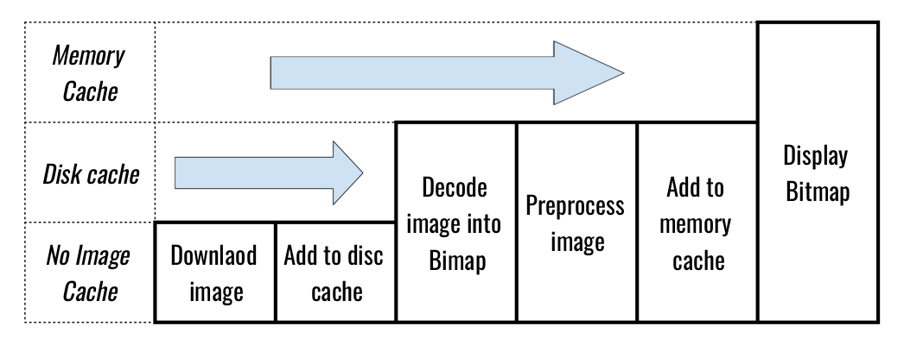

# ImagesSubRedditViewer
[](https://jitpack.io/#rajatsangrame/ImagesSubRedditViewer)

## Features
 * Asynchronously load the image onto the ImageView.
 * Load the images faster by caching it in memory.
 * Load the images faster by using disk-level caching.

## Installation

```groovy
allprojects {
        repositories {
        jcenter()
        maven { url "https://jitpack.io" }
    }
}

dependencies {
	implementation 'com.github.rajatsangrame:ImagesSubRedditViewer:1.0.0'
}
```

## Usage

```java
        ImageLoader.get(this)
                .loadUrl(url)
                .target(imageView)
                .execute();
```

You can also add a `ImageListener` for the result e.g.

```java
        ImageLoader.get(this)
                ..
                .addListener(new ImageListener(..)
                .execute();
```

## Caching



### License

```
   Copyright (C) 2020 Rajat Sangrame

   Licensed under the Apache License, Version 2.0 (the "License");
   you may not use this file except in compliance with the License.
   You may obtain a copy of the License at

       http://www.apache.org/licenses/LICENSE-2.0

   Unless required by applicable law or agreed to in writing, software
   distributed under the License is distributed on an "AS IS" BASIS,
   WITHOUT WARRANTIES OR CONDITIONS OF ANY KIND, either express or implied.
   See the License for the specific language governing permissions and
   limitations under the License.
```


